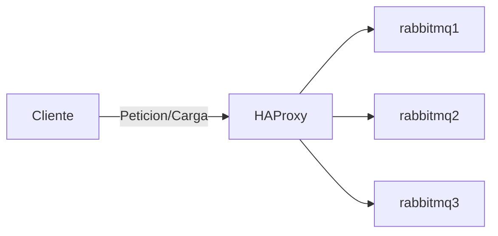

# RabbitMQ Cluster con HAProxy – Docker Compose

## Descripción
Este proyecto levanta un **cluster de 3 nodos RabbitMQ** con **balanceo de carga mediante HAProxy** usando Docker Compose, basado en el challenge [CHENNAI de sadservers](https://sadservers.com/scenario/chennai):

- RabbitMQ 4.1+ con plugin Management UI.
- HAProxy balancea conexiones AMQP usando **round-robin**.
- Logs de RabbitMQ van a **stdout** (sin scripts custom).
- Cluster fácilmente escalable y mantenible.

---

## Requisitos

- Docker 24.x o superior  
- Docker Compose 2.17.x o superior  
- `.env` con usuario y cookie compartida  

---

## Estructura de archivos

```markdown
├── docker-compose.yml 
├── haproxy.cfg 
├── .env 
├── consumer.py 
├── producer.py 
├── README.md 
└── Makefile (automatiza build del proyecto) 
```

---

## Variables de entorno (`.env`)

```env
RABBITMQ_COOKIE=supersecretcookie
RABBITMQ_USER=admin
RABBITMQ_PASS=admin
```

## Levantar el ambiente (`Makefile`)

Tenemos un archivo Makefile que facilita el levantamiento, solo coloca `make` en la terminal y listo

Esto contiene nuesto `Makefile`:

```Makefile
.PHONY: init

init: down up

down:
		docker compose down --volumes --remove-orphans

pull:
		docker compose pull

build:
		docker compose build

up: pull build
		docker compose up -d
```

## Arquitectura


## Prueba de scripts

Hay 2 scripts:
- **`producer.py`**
- **`consumer.py`**

Hay que considerar que al levantar el docker compose estos no se incluyen, por lo que para poder ejecutarlos se recomienda levantar un vitual enviroment con la herramienta que mas utilice (pipenv, venv, conda, poetry, UV) por mencionar algunos.

Una vez teniendo el entorno virtual instale [pika](https://pika.readthedocs.io/en/stable/), que es la libreria que utiliza python para comunicarse con RabbitMQ
El comando para instalarlo suele ser 
```bash
pip install pika
```

luego correr el script `producer.py` y pasar el mensaje como argumento
```bash
python producer.py HELLOWORLD
Message sent to RabbitMQ
```
con esto el mensaje a los servicios de rabbitmq se ha enviado.

Ahora para recibir/consumir esos mensajes, se ejecuta el script `consumer.py` y se devolvera el mensaje enviado, si se ha enviado mas de un mensaje, el orden de consumo es un FiFO ("primero en entrar, primero en salir").
```bash
python consumer.py
HELLOWORLD
```
Con esto tenemos el escenario levantado justo como la plataforma de sadservers lo implementa.
